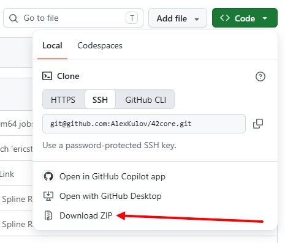

# 42core - lightweight 42 fork and "core" submodule of the 42shell

## Brief.   
1. 42core - lightweight 42 fork. In compare origin 42 - 327 Mb,   
42core - 77 Mb, if you use "download ZIP"   

   
2. 42core - submodule for 42shell  
https://github.com/AlexKulov/42shell   
   
But, You can use this fork independently:   
2. For example, you can make 42core on Win by mingw32-make (without MSYS)   
2.1 download glew(freeglut) from somewhere. For example:   
https://github.com/AlexKulov/42shell/tree/master/42support/freeglut   
https://github.com/AlexKulov/42shell/tree/master/42support/glew       
2.2 rename glew -> GLEW and put both (GLEW, freeglut) into 42core    
2.3 copy GLEW\include\GL and freeglut\include\GL into Include\GL (common folder)    
2.3 start mingw32-make from 42core folder   
   
3. You can start 42.exe without GUI.    
```
InOut/Inp_Sim.txt   
FALSE                            !  Graphics Front End?
```       
   
4. If start with GUI (Graphics Front End is TRUE), then you need    
4.1 copy from origin 42   
[./Model/Noise3DTex.raw](https://github.com/ericstoneking/42/blob/master/Model/Noise3DTex.raw)   
[./Model/GlastLogo.ppm] (https://github.com/ericstoneking/42/blob/master/Model/GlastLogo.ppm)   
4.2 near 42.exe you need glew(freeglut) dll-file (from GLEW and freeglut folder)       

## Branches

Now there is 2 branches:   
* master   
* server   
Server branch only for console mode.   
You don't need anything except to compile (Make or CMake) and run.   
I left only 2 examples from the native 42: InOut and Standalone   
   
> My be in future will be exist branch "stm32"   

## More information   
  https://github.com/AlexKulov/42shell/blob/master/README.md


 

